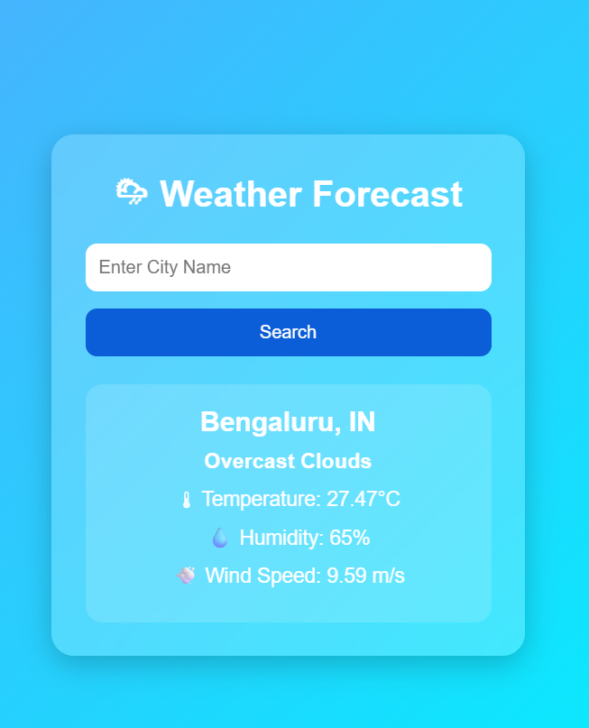
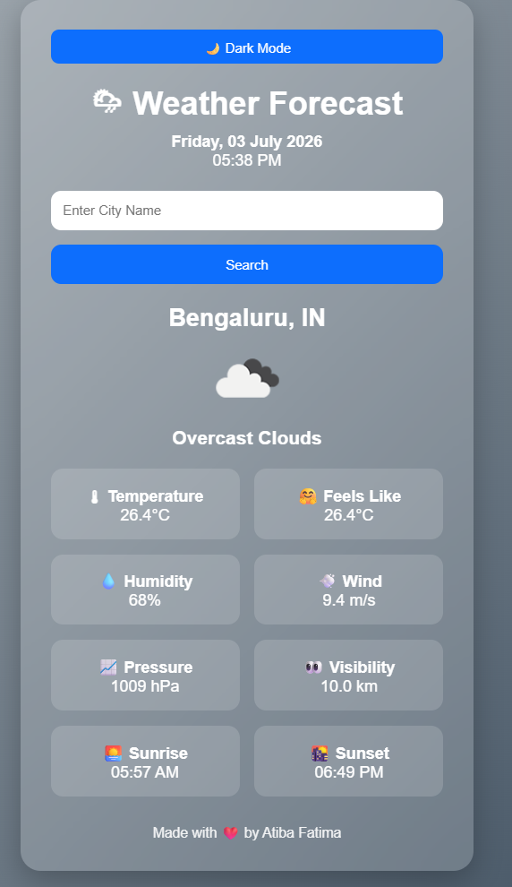
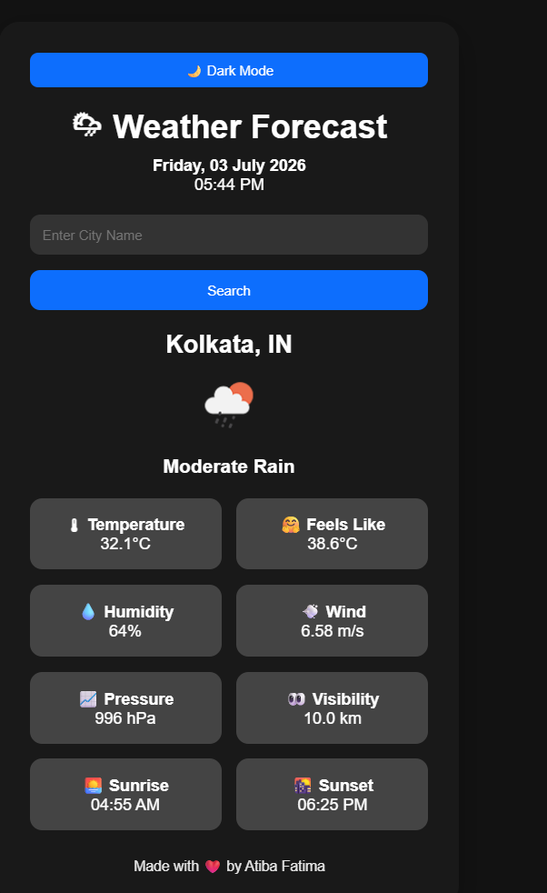

# 🌦 Weather Forecast App

A Flask-based weather application using OpenWeather API.

## Features
- Search weather by city
- Real-time temperature
- Weather icon
- Humidity, Wind, Pressure, Visibility
- Sunrise & Sunset
- Dark Mode
- Dynamic background

## Tech Stack
- Python
- Flask
- HTML
- CSS
- OpenWeather API

## Run Project
```bash
pip install -r requirements.txt
python app.py
## 📸 Screenshots

### 🏠 Home Page


### 🌞 Light Mode


### 🌙 Dark Mode
